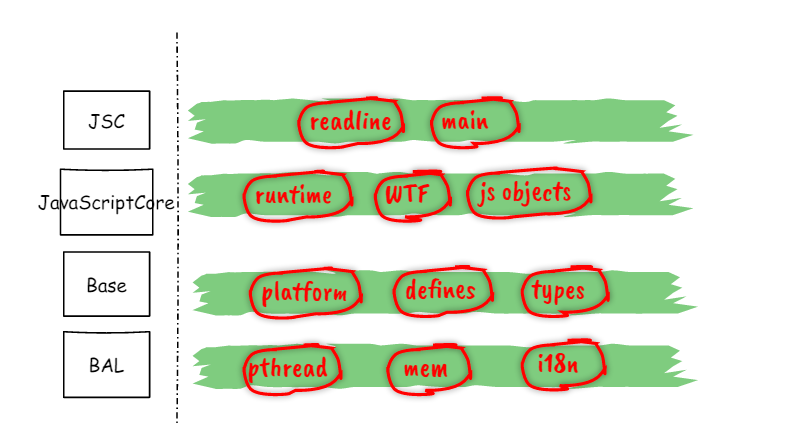

# cricket-jscore  [](./LICENSE.md)

* An ecma5 support JavaScript Engine originated from owb-browser(obsolete) ;
* On research purpose ;

## Architecture


## Dependencies

### icu (ver>=38)
* International character support ;
* [icu-project](http://icu-project.org/)

## Building (verified on ubuntu1404)
```{bash}
make distclean
make
```

## Running test


## Other JavaScript Engine Reference 
* [mozjs](https://developer.mozilla.org/en-US/docs/Mozilla/Projects/SpiderMonkey) - Mozilla SpiderMonkey
* [v8](https://v8.dev/) - Google V8 

## Lua 
* [lua](https://www.lua.org/start.html)
* [lua-jit](http://luajit.org/)

## Dart
* [dart](https://dart.dev/)

## MIT License
